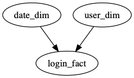

# Yet Another Dag Executor

## Example DAG file

The following is an example of a simple DAG file `dag.xml` representing two tasks that need to run
before a third task is executed.

    <dag name="my_dag">

      <task name="date_dim">
        <file>scripts/dim/date_dim.py</file>
        <cmd>python %s</cmd>
      </task>

      <task name="user_dim">
        <file>scripts/dim/user_dim.py</file>
        <cmd>python %s</cmd>
      </task>

      <task name="login_fact">
        <dep>date_dim</dep>
        <dep>user_dim</dep>
        <file>scripts/fact/login_fact.py</file>
        <cmd>python %s</cmd>
      </task>

    </dag>

Why in the world is `yade` using XML? Mainly as a statement against other DAG executors. Writing or
updating a DAG file should be an infrequent activity. The majority of our time should be spent in
developping the tasks themselves. Thus, if you find the XML of `yade` being annoying then you are
probably spending too much time in your `yade` DAG file!

The `<file>` tag is special in `yade` as it lets you include a path to a file that is required for
the execution of the DAG. The presence of these files are checked during validation and the path
should be absolute or relative to the location of the DAG file itself. The file paths can be placed
in the commands using one or more `%s` formatting directives.

## Visualizing a DAG

The `yade` cli utility has a built in xml to dot converter which when run will output a dot file
which can be used by visualization tools. For example:

    $ yade --dot dag.xml
    digraph my_dag {
      date_dim [label="date_dim"];
      user_dim [label="user_dim"];
      login_fact [label="login_fact"];
      date_dim -> login_fact;
      user_dim -> login_fact;
    }

When using a tool to generate this graph you might end up with something like:

## Validating and dry running a DAG

Dry running a dag involves running all validations and stepping through the DAG in the correct
order without executing the commands. This is a great way to ensure your DAG is valid and runnable
and that all requires files are present.

    $ yade --dry dag.xml
    2019/02/01 09:05:37
    2019/02/01 09:05:37 o   o   O  o-o   o--o
    2019/02/01 09:05:37  \ /   / \ |  \  |
    2019/02/01 09:05:37   O   o---o|   O O-o
    2019/02/01 09:05:37   |   |   ||  /  |
    2019/02/01 09:05:37   o   o   oo-o   o--o
    2019/02/01 09:05:37
    2019/02/01 09:05:37 Starting Yet Another Dag Executor
    2019/02/01 09:05:37
    2019/02/01 09:05:37 Dag: dag.xml
    2019/02/01 09:05:37 Dry: true
    2019/02/01 09:05:37 Workers: 8
    2019/02/01 09:05:37
    2019/02/01 09:05:37 [PASS] check dag 'my_dag' name
    2019/02/01 09:05:37 [PASS] check dag 'my_dag' task count
    2019/02/01 09:05:37 [PASS] check task 'date_dim' name
    2019/02/01 09:05:37 [PASS] check task 'date_dim' command
    2019/02/01 09:05:37 [PASS] check task 'date_dim' uniqueness
    2019/02/01 09:05:37 [PASS] check task 'user_dim' name
    2019/02/01 09:05:37 [PASS] check task 'user_dim' command
    2019/02/01 09:05:37 [PASS] check task 'user_dim' uniqueness
    2019/02/01 09:05:37 [PASS] check task 'login_fact' name
    2019/02/01 09:05:37 [PASS] check task 'login_fact' command
    2019/02/01 09:05:37 [PASS] check task 'login_fact' uniqueness
    2019/02/01 09:05:37 [PASS] check task 'date_dim' file 'scripts/dim/date_dim.py'
    2019/02/01 09:05:37 [PASS] check task 'user_dim' file 'scripts/dim/user_dim.py'
    2019/02/01 09:05:37 [PASS] check task 'login_fact' file 'scripts/fact/login_fact.py'
    2019/02/01 09:05:37 [PASS] check task 'login_fact' dependency 'date_dim'
    2019/02/01 09:05:37 [PASS] check task 'login_fact' dependency 'user_dim'
    2019/02/01 09:05:37 [PASS] check dag 'my_dag' for circular dependency
    2019/02/01 09:05:37
    2019/02/01 09:05:37 [SKIPPED] date_dim (python scripts/dim/date_dim.py)
    2019/02/01 09:05:37 [SKIPPED] user_dim (python scripts/dim/user_dim.py)
    2019/02/01 09:05:37 [SKIPPED] login_fact (python scripts/fact/login_fact.py)
    2019/02/01 09:05:37
    2019/02/01 09:05:37 Success

## Running a DAG

Running a dag simple requires invoking `yade` with the DAG file.

    $ yade dag.xml
    2019/02/01 09:04:46
    2019/02/01 09:04:46 o   o   O  o-o   o--o
    2019/02/01 09:04:46  \ /   / \ |  \  |
    2019/02/01 09:04:46   O   o---o|   O O-o
    2019/02/01 09:04:46   |   |   ||  /  |
    2019/02/01 09:04:46   o   o   oo-o   o--o
    2019/02/01 09:04:46
    2019/02/01 09:04:46 Starting Yet Another Dag Executor
    2019/02/01 09:04:46
    2019/02/01 09:04:46 Dag: dag.xml
    2019/02/01 09:04:46 Dry: false
    2019/02/01 09:04:46 Workers: 8
    2019/02/01 09:04:46
    2019/02/01 09:04:46 [PASS] check dag 'my_dag' name
    2019/02/01 09:04:46 [PASS] check dag 'my_dag' task count
    2019/02/01 09:04:46 [PASS] check task 'date_dim' name
    2019/02/01 09:04:46 [PASS] check task 'date_dim' command
    2019/02/01 09:04:46 [PASS] check task 'date_dim' uniqueness
    2019/02/01 09:04:46 [PASS] check task 'user_dim' name
    2019/02/01 09:04:46 [PASS] check task 'user_dim' command
    2019/02/01 09:04:46 [PASS] check task 'user_dim' uniqueness
    2019/02/01 09:04:46 [PASS] check task 'login_fact' name
    2019/02/01 09:04:46 [PASS] check task 'login_fact' command
    2019/02/01 09:04:46 [PASS] check task 'login_fact' uniqueness
    2019/02/01 09:04:46 [PASS] check task 'date_dim' file 'scripts/dim/date_dim.py'
    2019/02/01 09:04:46 [PASS] check task 'user_dim' file 'scripts/dim/user_dim.py'
    2019/02/01 09:04:46 [PASS] check task 'login_fact' file 'scripts/fact/login_fact.py'
    2019/02/01 09:04:46 [PASS] check task 'login_fact' dependency 'date_dim'
    2019/02/01 09:04:46 [PASS] check task 'login_fact' dependency 'user_dim'
    2019/02/01 09:04:46 [PASS] check dag 'my_dag' for circular dependency
    2019/02/01 09:04:46
    2019/02/01 09:04:46 [RUNNING] date_dim (python scripts/dim/date_dim.py)
    2019/02/01 09:04:46 [RUNNING] user_dim (python scripts/dim/user_dim.py)
    2019/02/01 09:04:46 [SUCCESS] date_dim
    2019/02/01 09:04:46 [SUCCESS] user_dim
    2019/02/01 09:04:46 [RUNNING] login_fact (python scripts/fact/login_fact.py)
    2019/02/01 09:04:47 [SUCCESS] login_fact
    2019/02/01 09:04:47
    2019/02/01 09:04:47 Success

## Resuming a failed DAG

Resuming a failed DAG is also possible using the `yade` utility. In particular, when a DAG fails a
retry file will be stored which can be run like a regular DAG file through the `yade` utility.
This retry DAG will start off from where the initial DAG run failed.

    $ yade dag.xml
    2019/02/01 09:06:21
    2019/02/01 09:06:21 o   o   O  o-o   o--o
    2019/02/01 09:06:21  \ /   / \ |  \  |
    2019/02/01 09:06:21   O   o---o|   O O-o
    2019/02/01 09:06:21   |   |   ||  /  |
    2019/02/01 09:06:21   o   o   oo-o   o--o
    2019/02/01 09:06:21
    2019/02/01 09:06:21 Starting Yet Another Dag Executor
    2019/02/01 09:06:21
    2019/02/01 09:06:21 Dag: dag.xml
    2019/02/01 09:06:21 Dry: false
    2019/02/01 09:06:21 Workers: 8
    2019/02/01 09:06:21
    2019/02/01 09:06:21 [PASS] check dag 'my_dag' name
    2019/02/01 09:06:21 [PASS] check dag 'my_dag' task count
    2019/02/01 09:06:21 [PASS] check task 'date_dim' name
    2019/02/01 09:06:21 [PASS] check task 'date_dim' command
    2019/02/01 09:06:21 [PASS] check task 'date_dim' uniqueness
    2019/02/01 09:06:21 [PASS] check task 'user_dim' name
    2019/02/01 09:06:21 [PASS] check task 'user_dim' command
    2019/02/01 09:06:21 [PASS] check task 'user_dim' uniqueness
    2019/02/01 09:06:21 [PASS] check task 'login_fact' name
    2019/02/01 09:06:21 [PASS] check task 'login_fact' command
    2019/02/01 09:06:21 [PASS] check task 'login_fact' uniqueness
    2019/02/01 09:06:21 [PASS] check task 'date_dim' file 'scripts/dim/date_dim.py'
    2019/02/01 09:06:21 [PASS] check task 'user_dim' file 'scripts/dim/user_dim.py'
    2019/02/01 09:06:21 [PASS] check task 'login_fact' file 'scripts/fact/login_fact.py'
    2019/02/01 09:06:21 [PASS] check task 'login_fact' dependency 'date_dim'
    2019/02/01 09:06:21 [PASS] check task 'login_fact' dependency 'user_dim'
    2019/02/01 09:06:21 [PASS] check dag 'my_dag' for circular dependency
    2019/02/01 09:06:21
    2019/02/01 09:06:21 [RUNNING] date_dim (python scripts/dim/date_dim.py)
    2019/02/01 09:06:21 [RUNNING] user_dim (python scripts/dim/user_dim.py)
    2019/02/01 09:06:21 date_dim (stderr) Traceback (most recent call last):
    2019/02/01 09:06:21 date_dim (stderr)   File "scripts/dim/date_dim.py", line 2, in <module>
    2019/02/01 09:06:21 date_dim (stderr)     print(y)
    2019/02/01 09:06:21 date_dim (stderr) NameError: name 'y' is not defined
    2019/02/01 09:06:21 [SUCCESS] user_dim
    2019/02/01 09:06:21 [ ERROR ] date_dim
    2019/02/01 09:06:21
    2019/02/01 09:06:21 Failure (resumable dag stored in retry-220990607.xml)

Then if we fix the problem in `user_dim.py` and resume the dag we see that the succesfull task from
the original DAG run is skipped and the failed task together with the dependent task is run.

    $ yade retry-220990607.xml
    2019/02/01 09:08:23
    2019/02/01 09:08:23 o   o   O  o-o   o--o
    2019/02/01 09:08:23  \ /   / \ |  \  |
    2019/02/01 09:08:23   O   o---o|   O O-o
    2019/02/01 09:08:23   |   |   ||  /  |
    2019/02/01 09:08:23   o   o   oo-o   o--o
    2019/02/01 09:08:23
    2019/02/01 09:08:23 Starting Yet Another Dag Executor
    2019/02/01 09:08:23
    2019/02/01 09:08:23 Dag: retry-220990607.xml
    2019/02/01 09:08:23 Dry: false
    2019/02/01 09:08:23 Workers: 8
    2019/02/01 09:08:23
    2019/02/01 09:08:23 [PASS] check dag 'my_dag' name
    2019/02/01 09:08:23 [PASS] check dag 'my_dag' task count
    2019/02/01 09:08:23 [PASS] check task 'date_dim' name
    2019/02/01 09:08:23 [PASS] check task 'date_dim' command
    2019/02/01 09:08:23 [PASS] check task 'date_dim' uniqueness
    2019/02/01 09:08:23 [PASS] check task 'user_dim' name
    2019/02/01 09:08:23 [PASS] check task 'user_dim' command
    2019/02/01 09:08:23 [PASS] check task 'user_dim' uniqueness
    2019/02/01 09:08:23 [PASS] check task 'login_fact' name
    2019/02/01 09:08:23 [PASS] check task 'login_fact' command
    2019/02/01 09:08:23 [PASS] check task 'login_fact' uniqueness
    2019/02/01 09:08:23 [PASS] check task 'date_dim' file 'scripts/dim/date_dim.py'
    2019/02/01 09:08:23 [PASS] check task 'user_dim' file 'scripts/dim/user_dim.py'
    2019/02/01 09:08:23 [PASS] check task 'login_fact' file 'scripts/fact/login_fact.py'
    2019/02/01 09:08:23 [PASS] check task 'login_fact' dependency 'date_dim'
    2019/02/01 09:08:23 [PASS] check task 'login_fact' dependency 'user_dim'
    2019/02/01 09:08:23 [PASS] check dag 'my_dag' for circular dependency
    2019/02/01 09:08:23
    2019/02/01 09:08:23 [RUNNING] date_dim (python scripts/dim/date_dim.py)
    2019/02/01 09:08:23 [SKIPPED] user_dim (python scripts/dim/user_dim.py)
    2019/02/01 09:08:23 [SUCCESS] date_dim
    2019/02/01 09:08:23 [RUNNING] login_fact (python scripts/fact/login_fact.py)
    2019/02/01 09:08:23 [SUCCESS] login_fact
    2019/02/01 09:08:23
    2019/02/01 09:08:23 Success
